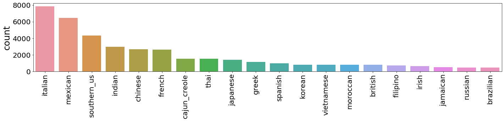
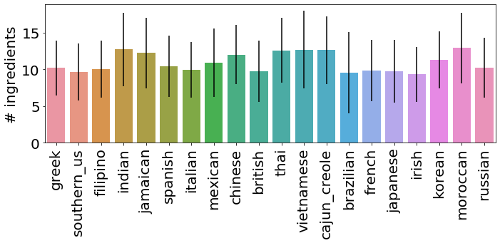
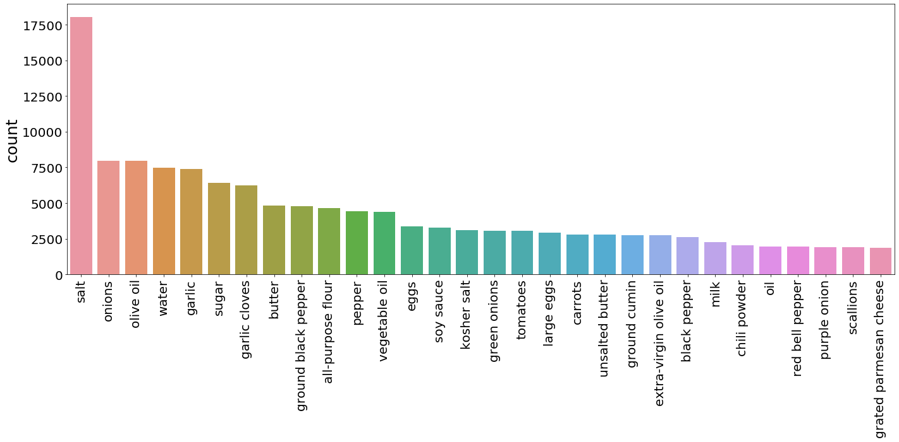
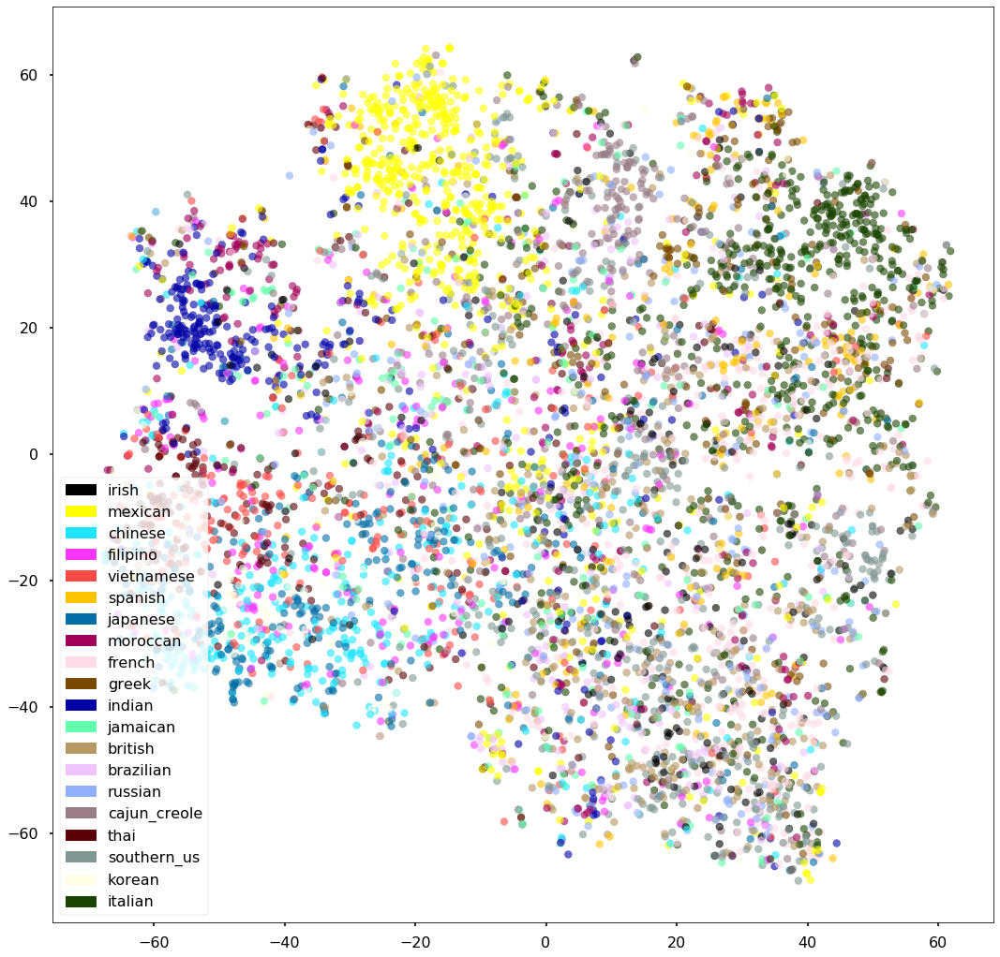

```python
import json
import numpy as np
import pandas as pd
import matplotlib.pyplot as plt
import re
import operator
import os
import random
import collections

from gensim.models import word2vec

from sklearn.manifold import TSNE
from sklearn.model_selection import train_test_split
from sklearn import tree
from sklearn.tree import export_graphviz

import graphviz
```


```python
import matplotlib.patches as mpatches
import seaborn as sns
import matplotlib
matplotlib.rcParams.update({'font.size': 15})
```

# EDA

### Check how many recipts, cuisines and ingredients and their distribution

1. Extract words in cuisine(y) and ingredients (X) from the json file


```python
trainrecipts = json.load(open('recipies.json','r'))

# Quick&dirty code to extract info2list
raw_ingredients = list()

for recipt in trainrecipts:
    for ingredient in recipt[u'ingredients']: # extract the words in ingredients
        raw_ingredients.append(ingredient.strip())      

raw_cuisines = list()
for recipt in trainrecipts:
    raw_cuisines.append(recipt[u'cuisine'].strip()) # extract the words in cuisine
```

2. Count number of ingredients and cuisines


```python
# use Counter to get frequencies 
counts_ingr = collections.Counter(raw_ingredients)
counts_cuis = collections.Counter(raw_cuisines)

# this will help us to have an idea how our corpora of ingredients looks like
print('Size Ingredients dataset (with repetition):  \t{}'.format((len(raw_ingredients))))
print('Unique Ingredients dataset: \t\t\t{}'.format((len(counts_ingr.values()))))

# This will provide a distribution of cusines, indirect info of the ingredients
print('Total # of recipts \t\t\t\t{}'.format(len(raw_cuisines)))
print('Total # of Cuisines \t\t\t\t{}'.format((len(counts_cuis.values()))))
```

    Size Ingredients dataset (with repetition):  	428275
    Unique Ingredients dataset: 			6714
    Total # of recipts 				39774
    Total # of Cuisines 				20


3. Check how many recipes in each cuisine


```python
counts_cuis.most_common(20) # in total there are 20 cuisines
x_cu = [cu for cu, frq in counts_cuis.most_common()]
y_frq = [frq for cu, frq in counts_cuis.most_common()]

plt.figure(figsize = (20,5))
fbar = sns.barplot(x = x_cu, y = y_frq)
plt.xticks(rotation=90, fontsize = 20)                                                               
plt.yticks(fontsize = 20)
plt.ylabel('count', fontsize = 25)
plt.tight_layout()

plt.savefig('cuisines_dist.jpg')
```





4. Check how many ingredients in one cuisine


```python
# init a dict with a empty list
num_ingredients = dict(zip(counts_cuis.keys(), [list() for x in counts_cuis.keys()]))

# num_ingredients is a dictionary of the numebr of ingredients in each receipt
for recipt in trainrecipts:
    # append the number in the list
    num_ingredients[recipt['cuisine']].append(len(recipt['ingredients']))

```


```python
for cu, frq in num_ingredients.items():
    print('{}    \t\t{:.2f}'.format(cu, np.mean(frq))) 
    # print the mean num ber of ingredients of receipt for each cuisine

x_cu = [cu for cu, frq in num_ingredients.items()] # get cuisine name
y_frq = [np.mean(frq) for cu, frq in num_ingredients.items()] # get mean number of ingredients of each cuisine
err = [np.std(frq) for cu, frq in num_ingredients.items()] # get standard deviation of ingredients of each cuisine
```

    greek    		10.18
    southern_us    		9.63
    filipino    		10.00
    indian    		12.71
    jamaican    		12.21
    spanish    		10.42
    italian    		9.91
    mexican    		10.88
    chinese    		11.98
    british    		9.71
    thai    		12.55
    vietnamese    		12.68
    cajun_creole    		12.62
    brazilian    		9.52
    french    		9.82
    japanese    		9.74
    irish    		9.30
    korean    		11.28
    moroccan    		12.91
    russian    		10.22


```python
plt.figure(figsize = (10,5))
fbar = sns.barplot(x = x_cu, y = y_frq, yerr=err)
plt.yticks(np.arange(0, 20, 5))

plt.xticks(rotation=90, fontsize = 20)                                                               
plt.yticks(fontsize = 20)
plt.ylabel('# ingredients', fontsize = 20)
plt.tight_layout()

plt.savefig('cuisines_ingre_dist.jpg')
```





5. Check the most common ingredients


```python
# Dispersion of the frequencies Ingredients
print(np.mean(list(counts_ingr.values())))
print(np.std(list(counts_ingr.values())))
```

    63.7883526958594
    388.3270259662557


```python
x_cu = [cu for cu, frq in counts_ingr.most_common(30)]
y_frq = [frq for cu, frq in counts_ingr.most_common(30)]

plt.figure(figsize = (20,10))
fbar = sns.barplot(x = x_cu, y = y_frq)
plt.xticks(rotation=90, fontsize = 20)                                                               
plt.yticks(fontsize = 20)
plt.ylabel('count', fontsize = 25)
plt.tight_layout()
plt.savefig('ingre_count.jpg')
```





### Create word2vec model of ingredients for data clustering of cuisine using tSNE

1. remove special symbols and irrelevant words such as crushed|crumbles|ground|minced|powder|chopped|sliced


```python
## check if need to remove symbols
symbols = list() 

for recipt in trainrecipts:
    # I want ingredient remove 
    for ingredient in recipt['ingredients']:
        if re.match("\(|@|\$\?", ingredient.lower()):
            symbols.append(ingredient)
print (len(symbols))
np.unique(symbols)
```

    33


    array(['(    oz.) tomato sauce', '(   oz.) tomato paste',
           '(10 oz.) frozen chopped spinach',
           '(10 oz.) frozen chopped spinach, thawed and squeezed dry',
           '(14 oz.) sweetened condensed milk', '(14.5 oz.) diced tomatoes',
           '(15 oz.) refried beans'], dtype='<U56')


```python
## merge all the ingredients into sentences to generate WordtoVec model
sentences = list()
# one hot ingredients


for recipt in trainrecipts:
    clean_recipt = list()
    # I want ingredient remove 
    for ingredient in recipt['ingredients']:
        # remove this description from the ingredients
        # minimal preprocessing
        ingredient =  re.sub(r'\(.*oz.\)|crushed|crumbles|ground|minced|powder|chopped|sliced', # remove all these
                             '', 
                             ingredient)
        clean_recipt.append(ingredient.strip())
    sentences.append(clean_recipt)
        
len(sentences)
```


    39774


2. create word2vec model


```python
## create word2vec model
# Set values for NN parameters
num_features = 300    # Word vector dimensionality                      
min_word_count = 0                       
num_workers = 4       # Number of CPUs
context = 10          # Context window size; 
                      # let's use avg recipte size                                                                                  
downsampling = 1e-3   # threshold for configuring which 
                      # higher-frequency words are randomly downsampled

# Initialize and train the model 
model_wv = word2vec.Word2Vec(sentences, workers=num_workers, \
            size=num_features, min_count = min_word_count, \
            window = context, sample = downsampling)

# If you don't plan to train the model any further, calling 
# init_sims will make the model much more memory-efficient.
model_wv.init_sims(replace=True)
```


```python
## Check performance of the word2vec model
model_wv.most_similar(u'feta cheese')
```

    /home/ubuntu/anaconda3/envs/tensorflow_p36/lib/python3.6/site-packages/ipykernel_launcher.py:2: DeprecationWarning: Call to deprecated `most_similar` (Method will be removed in 4.0.0, use self.wv.most_similar() instead).
      


    [('kalamata', 0.9450167417526245),
     ('dillweed', 0.9355379939079285),
     ('olives', 0.9159274697303772),
     ('fresh oregano', 0.9138096570968628),
     ('pitted kalamata olives', 0.9135211706161499),
     ('grape tomatoes', 0.9065653085708618),
     ('roasted red peppers', 0.9059627056121826),
     ('pitas', 0.8965719938278198),
     ('cherry tomatoes', 0.8911534547805786),
     ('plum tomatoes', 0.8857192993164062)]


```python
corpus = sorted(model_wv.wv.vocab.keys()) 
emb_tuple = tuple([model_wv[v] for v in corpus])
X = np.vstack(emb_tuple)
```

    /home/ubuntu/anaconda3/envs/tensorflow_p36/lib/python3.6/site-packages/ipykernel_launcher.py:2: DeprecationWarning: Call to deprecated `__getitem__` (Method will be removed in 4.0.0, use self.wv.__getitem__() instead).
      


```python
model_wv.wv.save_word2vec_format('ingredients_embedding.txt', binary = False)
# save the word to vec model for later use
```

    /home/ubuntu/anaconda3/envs/tensorflow_p36/lib/python3.6/site-packages/smart_open/smart_open_lib.py:398: UserWarning: This function is deprecated, use smart_open.open instead. See the migration notes for details: https://github.com/RaRe-Technologies/smart_open/blob/master/README.rst#migrating-to-the-new-open-function
      'See the migration notes for details: %s' % _MIGRATION_NOTES_URL


3. create tSNE visualization based on word2vec


```python
tsne = TSNE(n_components=2) 
X_tsne = tsne.fit_transform(X)
```


```python
track_ingredients = dict(zip(counts_cuis.keys(), [list() for x in counts_cuis.keys()]))
for recipt in trainrecipts:
    # append the number in the list
    clean_recipt = list()
    # I want ingredient remove 
    for ingredient in recipt['ingredients']:
        # remove this description from the ingredients
        # (10 oz.) 
        ingredient =  re.sub(r'crushed|crumbles|ground|minced|powder|chopped|sliced', '', ingredient)
        clean_recipt.append(ingredient.strip())
        
    track_ingredients[recipt['cuisine']].extend(clean_recipt)

for label, tracking in track_ingredients.items():
    track_ingredients[label] = collections.Counter(tracking)
```


```python
# print the common ingredients of each cuisine
for key in track_ingredients:
    print (key, 'food has common ingredients of:')
    sorted_values = sorted(track_ingredients[key].items(), key=operator.itemgetter(1))
    print(sorted_values[-10:])
    print('')

```

    greek food has common ingredients of:
    [('fresh lemon juice', 222), ('pepper', 224), ('extra-virgin olive oil', 229), ('garlic cloves', 254), ('dried oregano', 267), ('black pepper', 310), ('garlic', 330), ('feta cheese', 443), ('olive oil', 504), ('salt', 572)]
    
    southern_us food has common ingredients of:
    [('milk', 645), ('unsalted butter', 655), ('water', 686), ('baking', 729), ('black pepper', 736), ('large eggs', 746), ('sugar', 1054), ('all-purpose flour', 1222), ('butter', 1255), ('salt', 2290)]
    
    filipino food has common ingredients of:
    [('carrots', 128), ('sugar', 136), ('black pepper', 153), ('oil', 166), ('pepper', 209), ('soy sauce', 251), ('water', 310), ('onions', 310), ('garlic', 394), ('salt', 421)]
    
    indian food has common ingredients of:
    [('ginger', 694), ('cumin seed', 697), ('turmeric', 728), ('water', 820), ('coriander', 820), ('cumin', 861), ('garam masala', 862), ('garlic', 894), ('onions', 1195), ('salt', 1934)]
    
    jamaican food has common ingredients of:
    [('dried thyme', 105), ('scallions', 111), ('cinnamon', 120), ('pepper', 136), ('water', 153), ('onions', 173), ('allspice', 181), ('black pepper', 192), ('garlic', 202), ('salt', 332)]
    
    spanish food has common ingredients of:
    [('pepper', 145), ('water', 158), ('tomatoes', 172), ('garlic', 193), ('black pepper', 220), ('onions', 253), ('extra-virgin olive oil', 255), ('garlic cloves', 290), ('olive oil', 387), ('salt', 460)]
    
    italian food has common ingredients of:
    [('pepper', 1042), ('water', 1052), ('onions', 1240), ('extra-virgin olive oil', 1362), ('grated parmesan cheese', 1580), ('garlic cloves', 1619), ('black pepper', 2080), ('garlic', 2146), ('olive oil', 3111), ('salt', 3454)]
    
    mexican food has common ingredients of:
    [('avocado', 1044), ('tomatoes', 1050), ('sour cream', 1076), ('jalapeno chilies', 1146), ('olive oil', 1289), ('chili', 1337), ('onions', 1493), ('cumin', 1971), ('garlic', 2056), ('salt', 2720)]
    
    chinese food has common ingredients of:
    [('vegetable oil', 602), ('ginger', 683), ('green onions', 704), ('water', 762), ('sugar', 824), ('corn starch', 906), ('salt', 907), ('sesame oil', 915), ('garlic', 1093), ('soy sauce', 1363)]
    
    british food has common ingredients of:
    [('large eggs', 110), ('baking', 122), ('onions', 142), ('sugar', 176), ('eggs', 191), ('unsalted butter', 191), ('milk', 202), ('butter', 222), ('all-purpose flour', 238), ('salt', 407)]
    
    thai food has common ingredients of:
    [('garlic cloves', 299), ('green onions', 304), ('water', 310), ('sugar', 330), ('soy sauce', 332), ('vegetable oil', 335), ('coconut milk', 354), ('salt', 396), ('garlic', 552), ('fish sauce', 625)]
    
    vietnamese food has common ingredients of:
    [('garlic cloves', 148), ('soy sauce', 155), ('black pepper', 155), ('shallots', 158), ('carrots', 197), ('water', 227), ('salt', 264), ('garlic', 338), ('sugar', 344), ('fish sauce', 392)]
    
    cajun_creole food has common ingredients of:
    [('green onions', 306), ('olive oil', 316), ('cayenne pepper', 322), ('butter', 334), ('celery', 391), ('green bell pepper', 424), ('black pepper', 435), ('onions', 529), ('garlic', 654), ('salt', 743)]
    
    brazilian food has common ingredients of:
    [('sugar', 69), ('cachaca', 70), ('tomatoes', 78), ('garlic cloves', 83), ('water', 87), ('lime', 89), ('garlic', 106), ('olive oil', 118), ('onions', 133), ('salt', 194)]
    
    french food has common ingredients of:
    [('garlic cloves', 403), ('large eggs', 415), ('water', 439), ('butter', 514), ('olive oil', 516), ('black pepper', 557), ('unsalted butter', 592), ('all-purpose flour', 593), ('sugar', 637), ('salt', 1203)]
    
    japanese food has common ingredients of:
    [('garlic', 222), ('scallions', 229), ('vegetable oil', 245), ('rice vinegar', 261), ('sake', 289), ('water', 383), ('sugar', 401), ('mirin', 402), ('salt', 422), ('soy sauce', 561)]
    
    irish food has common ingredients of:
    [('black pepper', 110), ('milk', 111), ('baking', 112), ('baking soda', 115), ('sugar', 120), ('potatoes', 121), ('onions', 132), ('all-purpose flour', 219), ('butter', 219), ('salt', 376)]
    
    korean food has common ingredients of:
    [('scallions', 196), ('onions', 208), ('sesame seeds', 223), ('water', 242), ('salt', 253), ('sugar', 266), ('green onions', 307), ('sesame oil', 403), ('soy sauce', 427), ('garlic', 440)]
    
    moroccan food has common ingredients of:
    [('water', 182), ('garlic', 188), ('garlic cloves', 223), ('ginger', 230), ('black pepper', 239), ('onions', 280), ('cinnamon', 343), ('cumin', 410), ('olive oil', 412), ('salt', 413)]
    
    russian food has common ingredients of:
    [('black pepper', 88), ('unsalted butter', 93), ('butter', 104), ('water', 111), ('eggs', 112), ('sour cream', 117), ('all-purpose flour', 123), ('onions', 145), ('sugar', 155), ('salt', 288)]
    


```python
def return_most_popular(v):
    cuisine = None
    record = 0
    for label, tracking in track_ingredients.items():
        norm_freq = float(tracking[v]) / float(counts_cuis[label])
        if norm_freq > record:
            cuisine = label
            record = norm_freq
    return cuisine # find the most likely cuisine (highest frequency) for the cuisine
```


```python
track_2color = {u'irish':"#000000", # blak
                u'mexican':"#FFFF00", #yellow
                u'chinese':"#1CE6FF", #cyan
                u'filipino': "#FF34FF", #pink 
                u'vietnamese':"#FF4A46", #red
                u'spanish':"#FFC300",  # green forest
                u'japanese':"#006FA6", # blue ocean
                u'moroccan':"#A30059",# purple
                u'french':"#FFDBE5",  #light pink
                u'greek': "#7A4900",  # gold or brown 
                u'indian':"#0000A6", # blue electric 
                u'jamaican':"#63FFAC", # green phospho
                u'british': "#B79762", #brown
                u'brazilian': "#EEC3FF", #  
                u'russian':"#8FB0FF", # light blue 
                u'cajun_creole':"#997D87", #violet
                u'thai':"#5A0007", 
                u'southern_us':"#809693", 
                u'korean':"#FEFFE6", #ligt yellow
                u'italian':"#1B4400"}

color_vector = list()
for v in corpus:
    cuisine = return_most_popular(v)
    color_vector.append(track_2color[cuisine])

```


```python
len(color_vector) # each dot in the tSNE map is an ingredients
```


    6549


```python
# ensemble the legend
lgend = list()
for l, c in track_2color.items():
    lgend.append(mpatches.Patch(color=c, label=l))
```


```python
sns.set_context("poster")
fig, ax = plt.subplots(figsize=(18,18))
plt.scatter(X_tsne[:, 0], X_tsne[:, 1], c=color_vector, alpha=.6, s=60)
plt.legend(handles=lgend, loc='lower left')
plt.savefig('tSNE')
```




