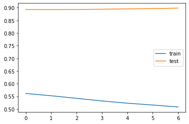
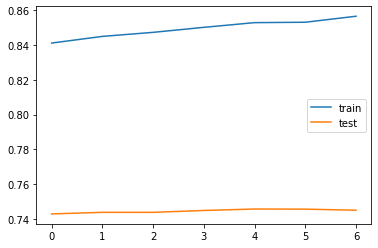
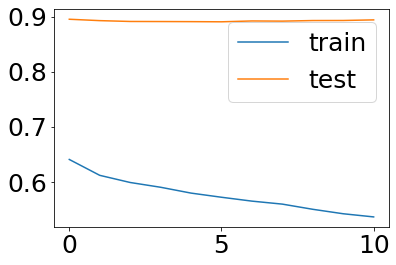
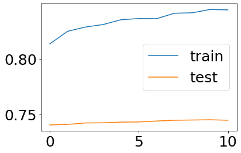
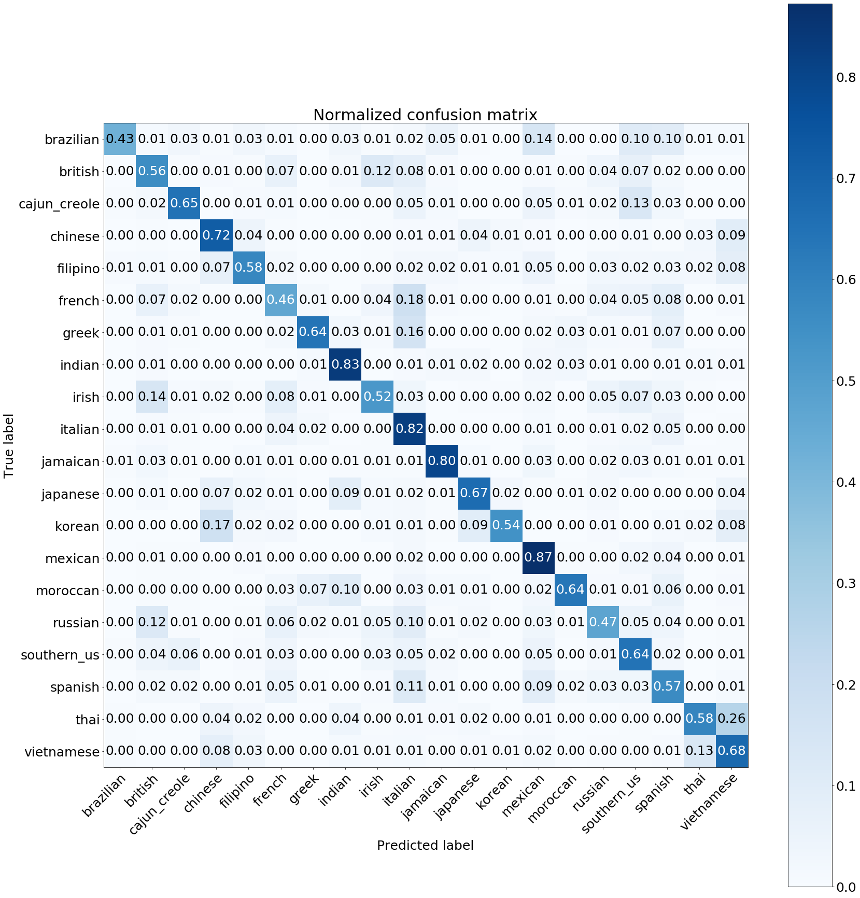

```python
import json
import re
import os

import random
import matplotlib.pyplot as plt
import numpy as np

from sklearn.metrics import confusion_matrix 
from keras.preprocessing.sequence import pad_sequences
from keras.preprocessing.text import Tokenizer
from keras.utils import to_categorical
from keras.models import Sequential
from keras.layers import Dense, Embedding, LSTM, GRU, Bidirectional
from keras.callbacks import EarlyStopping, ModelCheckpoint

from sklearn.preprocessing import LabelEncoder, MultiLabelBinarizer
from sklearn.model_selection import train_test_split
from sklearn.utils import shuffle
from sklearn.utils.multiclass import unique_labels

```

    Using TensorFlow backend.


```python
import matplotlib
matplotlib.rcParams.update({'font.size': 25})
```

# Convert data


```python
trainrecipts = json.load(open('recipies.json','r'))

# Quick&dirty code to extract info2list
raw_ingredients = list()

for recipt in trainrecipts:
    for ingredient in recipt[u'ingredients']:
        raw_ingredients.append(ingredient.strip())      

raw_cuisines = list()
for recipt in trainrecipts:
    raw_cuisines.append(recipt[u'cuisine'].strip())

```


```python
## merge all the ingredients into sentences to generate WordtoVec model
sentences = list()
# one hot ingredients


for recipt in trainrecipts:
    clean_recipt = list()
    # I want ingredient remove 
    for ingredient in recipt['ingredients']:
        # remove this description from the ingredients
        # minimal preprocessing
        ingredient =  re.sub(r'\(.*oz.\)|crushed|crumbles|ground|minced|powder|chopped|sliced',
                             '', 
                             ingredient)
        clean_recipt.append(ingredient.strip())
    sentences.append(clean_recipt)
        
len(sentences)
```


    39774


```python
def plot_confusion_matrix(y_true, y_pred, classes,
                          normalize=False,
                          title=None,
                          cmap=plt.cm.Blues):
    """
    This function prints and plots the confusion matrix.
    Normalization can be applied by setting `normalize=True`.
    """


    if not title:
        if normalize:
            title = 'Normalized confusion matrix'
        else:
            title = 'Confusion matrix, without normalization'

    # Compute confusion matrix
    cm = confusion_matrix(y_true, y_pred)
    # Only use the labels that appear in the data
    classes = classes[unique_labels(y_true, y_pred)]
    if normalize:
        cm = cm.astype('float') / cm.sum(axis=1)[:, np.newaxis]
        print("Normalized confusion matrix")
    else:
        print('Confusion matrix, without normalization')

#     print(cm)

    fig, ax = plt.subplots(figsize = (25,25))
    im = ax.imshow(cm, interpolation='nearest', cmap=cmap)
    ax.figure.colorbar(im, ax=ax)
    # We want to show all ticks...
    ax.set(xticks=np.arange(cm.shape[1]),
           yticks=np.arange(cm.shape[0]),
           # ... and label them with the respective list entries
           xticklabels=classes, yticklabels=classes,
           title=title,
           ylabel='True label',
           xlabel='Predicted label')

    # Rotate the tick labels and set their alignment.
    plt.setp(ax.get_xticklabels(), rotation=45, ha="right",
             rotation_mode="anchor")

    # Loop over data dimensions and create text annotations.
    fmt = '.2f' if normalize else 'd'
    thresh = cm.max() / 2.
    for i in range(cm.shape[0]):
        for j in range(cm.shape[1]):
            ax.text(j, i, format(cm[i, j], fmt),
                    ha="center", va="center",
                    color="white" if cm[i, j] > thresh else "black")
    fig.tight_layout()
    return ax

```

# Build LSTM model for classification

## Prepare data


```python
X = sentences
max_length = max([len(s) for s in X])
# maximum length of a number of ingredients

tokenizer_obj = Tokenizer()
tokenizer_obj.fit_on_texts(X)

X_token = tokenizer_obj.texts_to_sequences(X)
X_pad = pad_sequences(X_token, maxlen = max_length, padding = 'post')
```


```python
y = raw_cuisines
np.shape(y)
le = LabelEncoder()
le.fit(y)

y_cat = le.transform(y) # convert y (cuisine to categorical data)
```


```python
X_train, X_test, y_train, y_test = train_test_split(X_pad, y_cat, test_size=0.33, random_state=42)
```


```python
EMBEDDING_DIM = 300
n_cuisines = 20
```

## Model development

### 1. Load the word2vec embedding that we produced earlier and use it as our embedding layer


```python
embeddings_index = {}
f = open(os.path.join('','ingredients_embedding.txt'), encoding = 'utf-8')
for line in f:
    values = line.split()
    word = values[0]
    coefs = np.asarray(values[1:])
    embeddings_index[word] = coefs
    
f.close()

word_index = tokenizer_obj.word_index
num_words = len(word_index) + 1

embedding_matrix = np.zeros((len(word_index) + 1, EMBEDDING_DIM))
for word, i in word_index.items():
    embedding_vector = embeddings_index.get(word)
    if embedding_vector is not None:
        # words not found in embedding index will be all-zeros.
        embedding_matrix[i] = embedding_vector[-EMBEDDING_DIM:]    
```

#### GRU

The GRU is like a long short-term memory (LSTM) with forget gate. but has fewer parameters than LSTM, as it lacks an output gate.GRU's performance on certain tasks of polyphonic music modeling and speech signal modeling was found to be similar to that of LSTM. GRUs have been shown to exhibit even better performance on certain smaller datasets.


```python
model_wv_seq = Sequential()
embedding_layer = Embedding(len(word_index) + 1,
                            EMBEDDING_DIM,
                            weights=[embedding_matrix],
                            input_length=max_length,
                            trainable=False)
model_wv_seq.add(embedding_layer)
# model.add(Embedding(vocab_size, EMBEDDING_DIM, input_length = max_length))
model_wv_seq.add(GRU(units = 32, dropout = 0.2, recurrent_dropout = 0.2))
model_wv_seq.add(Dense(n_cuisines, activation = 'softmax'))
model_wv_seq.compile(loss = 'sparse_categorical_crossentropy', optimizer = 'adam', metrics = ['accuracy'])

model_wv_seq.summary()
```

    _________________________________________________________________
    Layer (type)                 Output Shape              Param #   
    =================================================================
    embedding_2 (Embedding)      (None, 65, 300)           1961400   
    _________________________________________________________________
    gru_2 (GRU)                  (None, 32)                31968     
    _________________________________________________________________
    dense_1 (Dense)              (None, 20)                660       
    =================================================================
    Total params: 1,994,028
    Trainable params: 32,628
    Non-trainable params: 1,961,400
    _________________________________________________________________


```python
model_wv_seq.fit(X_train, y_train, batch_size = 128, epochs = 5, validation_data = (X_test, y_test))
```

    WARNING:tensorflow:From /home/ubuntu/anaconda3/envs/tensorflow_p36/lib/python3.6/site-packages/tensorflow/python/ops/math_ops.py:3066: to_int32 (from tensorflow.python.ops.math_ops) is deprecated and will be removed in a future version.
    Instructions for updating:
    Use tf.cast instead.
    Train on 26648 samples, validate on 13126 samples
    Epoch 1/5
    26648/26648 [==============================] - 28s 1ms/step - loss: 2.6882 - acc: 0.1956 - val_loss: 2.6060 - val_acc: 0.1966
    Epoch 2/5
    26648/26648 [==============================] - 26s 971us/step - loss: 2.5493 - acc: 0.2402 - val_loss: 2.4301 - val_acc: 0.2804
    Epoch 3/5
    26648/26648 [==============================] - 26s 973us/step - loss: 2.3614 - acc: 0.2962 - val_loss: 2.2592 - val_acc: 0.3257
    Epoch 4/5
    26648/26648 [==============================] - 26s 974us/step - loss: 2.2330 - acc: 0.3445 - val_loss: 2.1421 - val_acc: 0.3783
    Epoch 5/5
    26648/26648 [==============================] - 26s 976us/step - loss: 2.1496 - acc: 0.3716 - val_loss: 2.0733 - val_acc: 0.3961


    <keras.callbacks.History at 0x7fe7a41b94e0>


#### Bidirectional GRU

The accuracy is not high. This may due to the order in the ingredients. In theory, one ingredient appears before or after anothger shouldn't affect the cuisine. However, in the one directional GRU, the order will affect the results. Therefore, I use bidirectional network instead.


```python
model_wv_seq_bi = Sequential()
embedding_layer = Embedding(len(word_index) + 1,
                            EMBEDDING_DIM,
                            weights=[embedding_matrix],
                            input_length=max_length,
                            trainable=False)
model_wv_seq_bi.add(embedding_layer)
# model.add(Embedding(vocab_size, EMBEDDING_DIM, input_length = max_length))
model_wv_seq_bi.add(Bidirectional(GRU(units = 32, dropout = 0.2, recurrent_dropout = 0.2)))
model_wv_seq_bi.add(Dense(n_cuisines, activation = 'softmax'))
model_wv_seq_bi.compile(loss = 'sparse_categorical_crossentropy', optimizer = 'adam', metrics = ['accuracy'])

model_wv_seq_bi.summary()
```

    _________________________________________________________________
    Layer (type)                 Output Shape              Param #   
    =================================================================
    embedding_3 (Embedding)      (None, 65, 300)           1961400   
    _________________________________________________________________
    bidirectional_1 (Bidirection (None, 64)                63936     
    _________________________________________________________________
    dense_2 (Dense)              (None, 20)                1300      
    =================================================================
    Total params: 2,026,636
    Trainable params: 65,236
    Non-trainable params: 1,961,400
    _________________________________________________________________


```python
model_wv_seq_bi.fit(X_train, y_train, batch_size = 128, epochs = 5, validation_data = (X_test, y_test))
```

    Train on 26648 samples, validate on 13126 samples
    Epoch 1/5
    26648/26648 [==============================] - 51s 2ms/step - loss: 2.5306 - acc: 0.2568 - val_loss: 2.2493 - val_acc: 0.3506
    Epoch 2/5
    26648/26648 [==============================] - 49s 2ms/step - loss: 2.2104 - acc: 0.3575 - val_loss: 2.1206 - val_acc: 0.3789
    Epoch 3/5
    26648/26648 [==============================] - 49s 2ms/step - loss: 2.1255 - acc: 0.3812 - val_loss: 2.0479 - val_acc: 0.3965
    Epoch 4/5
    26648/26648 [==============================] - 49s 2ms/step - loss: 2.0654 - acc: 0.3953 - val_loss: 1.9988 - val_acc: 0.4092
    Epoch 5/5
    26648/26648 [==============================] - 49s 2ms/step - loss: 2.0177 - acc: 0.4090 - val_loss: 1.9576 - val_acc: 0.4242


    <keras.callbacks.History at 0x7fe7a40a1ef0>


#### Accuracy improved from one directional GRU to bidirectional GRU
#### Next is to try bidirectional LSTM 


```python
model_wv_seq_bi_LSTM = Sequential()
embedding_layer = Embedding(len(word_index) + 1,
                            EMBEDDING_DIM,
                            weights=[embedding_matrix],
                            input_length=max_length,
                            trainable=False)
model_wv_seq_bi_LSTM.add(embedding_layer)
# model.add(Embedding(vocab_size, EMBEDDING_DIM, input_length = max_length))
model_wv_seq_bi_LSTM.add(Bidirectional(LSTM(units = 32, dropout = 0.2, recurrent_dropout = 0.2)))
model_wv_seq_bi_LSTM.add(Dense(n_cuisines, activation = 'softmax'))
model_wv_seq_bi_LSTM.compile(loss = 'sparse_categorical_crossentropy', optimizer = 'adam', metrics = ['accuracy'])

model_wv_seq_bi.summary()
```

    _________________________________________________________________
    Layer (type)                 Output Shape              Param #   
    =================================================================
    embedding_3 (Embedding)      (None, 65, 300)           1961400   
    _________________________________________________________________
    bidirectional_1 (Bidirection (None, 64)                63936     
    _________________________________________________________________
    dense_2 (Dense)              (None, 20)                1300      
    =================================================================
    Total params: 2,026,636
    Trainable params: 65,236
    Non-trainable params: 1,961,400
    _________________________________________________________________


```python
model_wv_seq_bi_LSTM.fit(X_train, y_train, batch_size = 128, epochs = 5, validation_data = (X_test, y_test))
```

    Train on 26648 samples, validate on 13126 samples
    Epoch 1/5
    26648/26648 [==============================] - 62s 2ms/step - loss: 2.5472 - acc: 0.2480 - val_loss: 2.2682 - val_acc: 0.3367
    Epoch 2/5
    26648/26648 [==============================] - 59s 2ms/step - loss: 2.2269 - acc: 0.3532 - val_loss: 2.1257 - val_acc: 0.3752
    Epoch 3/5
    26648/26648 [==============================] - 59s 2ms/step - loss: 2.1301 - acc: 0.3767 - val_loss: 2.0669 - val_acc: 0.3898
    Epoch 4/5
    26648/26648 [==============================] - 59s 2ms/step - loss: 2.0775 - acc: 0.3861 - val_loss: 2.0202 - val_acc: 0.4032
    Epoch 5/5
    26648/26648 [==============================] - 59s 2ms/step - loss: 2.0336 - acc: 0.4003 - val_loss: 1.9716 - val_acc: 0.4151


    <keras.callbacks.History at 0x7fe7a56b8080>


#### Accuracy didn't change by using  LSTM, therefore, go back to using GRU

### 2. train the embedding layer from scratch instead of using word2vec


```python
vocab_size = 6714 #number of ingredients, got from EDA

model = Sequential()
model.add(Embedding(vocab_size, EMBEDDING_DIM, input_length = max_length))
model.add(Bidirectional(GRU(units = 32, dropout = 0.2, recurrent_dropout = 0.2)))
model.add(Dense(n_cuisines, activation = 'softmax'))
model.compile(loss = 'sparse_categorical_crossentropy', optimizer = 'adam', metrics = ['accuracy'])

model.summary()
```

    _________________________________________________________________
    Layer (type)                 Output Shape              Param #   
    =================================================================
    embedding_7 (Embedding)      (None, 65, 300)           2014200   
    _________________________________________________________________
    bidirectional_5 (Bidirection (None, 64)                63936     
    _________________________________________________________________
    dense_6 (Dense)              (None, 20)                1300      
    =================================================================
    Total params: 2,079,436
    Trainable params: 2,079,436
    Non-trainable params: 0
    _________________________________________________________________


```python
model.fit(X_train, y_train, batch_size = 128, epochs = 5, validation_data = (X_test, y_test))
```

    Train on 26648 samples, validate on 13126 samples
    Epoch 1/5
    26648/26648 [==============================] - 57s 2ms/step - loss: 1.9562 - acc: 0.4390 - val_loss: 1.3777 - val_acc: 0.5958
    Epoch 2/5
    26648/26648 [==============================] - 53s 2ms/step - loss: 1.1986 - acc: 0.6457 - val_loss: 1.0608 - val_acc: 0.6884
    Epoch 3/5
    26648/26648 [==============================] - 53s 2ms/step - loss: 0.9274 - acc: 0.7235 - val_loss: 0.9606 - val_acc: 0.7151
    Epoch 4/5
    26648/26648 [==============================] - 53s 2ms/step - loss: 0.7671 - acc: 0.7747 - val_loss: 0.9117 - val_acc: 0.7339
    Epoch 5/5
    26648/26648 [==============================] - 53s 2ms/step - loss: 0.6630 - acc: 0.8078 - val_loss: 0.8968 - val_acc: 0.7416


    <keras.callbacks.History at 0x7fe700c3f9b0>


```python
from keras.optimizers import Adam

adam = Adam(lr=0.0001) # reduce training rate
```


```python
es = EarlyStopping(monitor='val_loss', mode='min', verbose=1, patience=5)
mc = ModelCheckpoint('best_model.hdf5', monitor='val_loss', mode='min', save_best_only=True)

model.compile(loss = 'sparse_categorical_crossentropy', optimizer = adam, metrics = ['accuracy'])
history = model.fit(X_train, y_train, batch_size = 128, epochs = 50, \
                    validation_data = (X_test, y_test),
                    callbacks=[es, mc])
# note that the model has trained for 5 epoches previously
```

    Train on 26648 samples, validate on 13126 samples
    Epoch 1/50
    26648/26648 [==============================] - 58s 2ms/step - loss: 0.5612 - acc: 0.8411 - val_loss: 0.8927 - val_acc: 0.7428
    Epoch 2/50
    26648/26648 [==============================] - 54s 2ms/step - loss: 0.5523 - acc: 0.8449 - val_loss: 0.8926 - val_acc: 0.7437
    Epoch 3/50
    26648/26648 [==============================] - 53s 2ms/step - loss: 0.5420 - acc: 0.8473 - val_loss: 0.8929 - val_acc: 0.7437
    Epoch 4/50
    26648/26648 [==============================] - 53s 2ms/step - loss: 0.5318 - acc: 0.8502 - val_loss: 0.8939 - val_acc: 0.7448
    Epoch 5/50
    26648/26648 [==============================] - 53s 2ms/step - loss: 0.5229 - acc: 0.8529 - val_loss: 0.8952 - val_acc: 0.7456
    Epoch 6/50
    26648/26648 [==============================] - 53s 2ms/step - loss: 0.5158 - acc: 0.8531 - val_loss: 0.8963 - val_acc: 0.7455
    Epoch 7/50
    26648/26648 [==============================] - 53s 2ms/step - loss: 0.5080 - acc: 0.8565 - val_loss: 0.8983 - val_acc: 0.7449
    Epoch 00007: early stopping


```python
# plot training history
plt.plot(history.history['loss'], label='train')
plt.plot(history.history['val_loss'], label='test')
plt.legend()
plt.show()
```





```python
# plot training history
plt.plot(history.history['acc'], label='train')
plt.plot(history.history['val_acc'], label='test')
plt.legend()
plt.show()
```





### Large difference between train and test, maybe the model is prone to overfitting. Try to increase the number of dropout


```python
vocab_size = 6714 #number of ingredients, got from EDA

model = Sequential()
model.add(Embedding(vocab_size, EMBEDDING_DIM, input_length = max_length))
model.add(Bidirectional(GRU(units = 32, dropout = 0.4, recurrent_dropout = 0.4)))
model.add(Dense(n_cuisines, activation = 'softmax'))
model.compile(loss = 'sparse_categorical_crossentropy', optimizer = 'adam', metrics = ['accuracy'])

model.summary()
```

    _________________________________________________________________
    Layer (type)                 Output Shape              Param #   
    =================================================================
    embedding_2 (Embedding)      (None, 65, 300)           2014200   
    _________________________________________________________________
    bidirectional_2 (Bidirection (None, 64)                63936     
    _________________________________________________________________
    dense_2 (Dense)              (None, 20)                1300      
    =================================================================
    Total params: 2,079,436
    Trainable params: 2,079,436
    Non-trainable params: 0
    _________________________________________________________________


```python
model.fit(X_train, y_train, batch_size = 128, epochs = 5, validation_data = (X_test, y_test))
```


```python
es = EarlyStopping(monitor='val_loss', mode='min', verbose=1, patience=5)
mc = ModelCheckpoint('best_model.hdf5', monitor='val_loss', mode='min', save_best_only=True)

model.compile(loss = 'sparse_categorical_crossentropy', optimizer = adam, metrics = ['accuracy'])
history = model.fit(X_train, y_train, batch_size = 128, epochs = 50, \
                    validation_data = (X_test, y_test),
                    callbacks=[es, mc])
# note that the model has trained for 5 epoches previously
```

    Train on 26648 samples, validate on 13126 samples
    Epoch 1/50
    26648/26648 [==============================] - 57s 2ms/step - loss: 0.6407 - acc: 0.8134 - val_loss: 0.8951 - val_acc: 0.7404
    Epoch 2/50
    26648/26648 [==============================] - 52s 2ms/step - loss: 0.6119 - acc: 0.8247 - val_loss: 0.8926 - val_acc: 0.7409
    Epoch 3/50
    26648/26648 [==============================] - 52s 2ms/step - loss: 0.5989 - acc: 0.8285 - val_loss: 0.8911 - val_acc: 0.7422
    Epoch 4/50
    26648/26648 [==============================] - 52s 2ms/step - loss: 0.5903 - acc: 0.8308 - val_loss: 0.8909 - val_acc: 0.7423
    Epoch 5/50
    26648/26648 [==============================] - 52s 2ms/step - loss: 0.5797 - acc: 0.8351 - val_loss: 0.8908 - val_acc: 0.7430
    Epoch 6/50
    26648/26648 [==============================] - 52s 2ms/step - loss: 0.5721 - acc: 0.8362 - val_loss: 0.8905 - val_acc: 0.7431
    Epoch 7/50
    26648/26648 [==============================] - 52s 2ms/step - loss: 0.5651 - acc: 0.8361 - val_loss: 0.8920 - val_acc: 0.7439
    Epoch 8/50
    26648/26648 [==============================] - 52s 2ms/step - loss: 0.5597 - acc: 0.8410 - val_loss: 0.8917 - val_acc: 0.7446
    Epoch 9/50
    26648/26648 [==============================] - 53s 2ms/step - loss: 0.5503 - acc: 0.8414 - val_loss: 0.8927 - val_acc: 0.7449
    Epoch 10/50
    26648/26648 [==============================] - 52s 2ms/step - loss: 0.5422 - acc: 0.8443 - val_loss: 0.8929 - val_acc: 0.7451
    Epoch 11/50
    26648/26648 [==============================] - 53s 2ms/step - loss: 0.5365 - acc: 0.8440 - val_loss: 0.8940 - val_acc: 0.7446
    Epoch 00011: early stopping


```python
# plot training history
plt.plot(history.history['loss'], label='train')
plt.plot(history.history['val_loss'], label='test')
plt.legend()
plt.show()
```





```python
# plot training history
plt.plot(history.history['acc'], label='train')
plt.plot(history.history['val_acc'], label='test')
plt.legend()
plt.show()
```





```python
model.load_weights('best_model.hdf5')
```


```python
def predict_model_index(i, le, y_test, model):
    results = model.predict(np.expand_dims(X_test[i],axis = 0))
    results = np.argmax(results)
    results = le.inverse_transform([results])
    print('predict cusine is', results, 'while real cusine is',le.inverse_transform([y_test[i]]))
```


```python
for i in range (10):
    predict_model_index(i, le, y_test, model)
```

    predict cusine is ['chinese'] while real cusine is ['chinese']
    predict cusine is ['southern_us'] while real cusine is ['spanish']
    predict cusine is ['greek'] while real cusine is ['greek']
    predict cusine is ['indian'] while real cusine is ['indian']
    predict cusine is ['italian'] while real cusine is ['italian']
    predict cusine is ['mexican'] while real cusine is ['mexican']
    predict cusine is ['italian'] while real cusine is ['italian']
    predict cusine is ['cajun_creole'] while real cusine is ['cajun_creole']
    predict cusine is ['greek'] while real cusine is ['greek']
    predict cusine is ['mexican'] while real cusine is ['mexican']


```python
y_pred = model.predict(X_test, verbose = 1)
y_pred_max = np.argmax(y_pred,axis = 1)
```

    13126/13126 [==============================] - 33s 3ms/step


```python
labels = le.classes_ # get label names for the confusion matrix
# Plot normalized confusion matrix
```


```python
plot_confusion_matrix(y_test, y_pred_max, classes=labels, normalize=True,
                      title='Normalized confusion matrix')
plt.savefig('confusion_nn1.jpg')
```

### Bad performance class: brazilian, british, filipino, irish, jamaican, russian, spanish, vietnamese are also minority classes, should do data augumentation

## Data augmentation for the minority class

choose the minority classes above that doesn't perform well:


```python
choosen_classes = ["brazilian", "british", "filipino", "irish", "jamaican", "russian", "spanish", "vietnamese"]
```

funciton to shuffle the position of the ingredients within the recipes


```python
def shuffle_whole_class(tokens_class, n):
    shuffled =[]
    
    for i in range(len(tokens_class)):
        for j in range(n):
            new_tokens = random.sample(tokens_class[i], len(tokens_class[i]))
            shuffled.append(new_tokens)
    
    return(shuffled)
```

prepare data to train and test set


```python
X_train, X_test, y_train, y_test = train_test_split(X_token, raw_cuisines, test_size=0.33, random_state=42)
# create training and test class

X_test = pad_sequences(X_test, maxlen = max_length, padding = 'post')
# pad to fixed length of 65 for each example
y_test = le.transform(y_test)
# convert y (cuisine) to one hot vector

new_x = np.asarray(X_train)
new_y = np.asarray(y_train)
```


```python
np.shape(new_x)
```


    (26648,)


```python
np.shape(new_y)
```


    (26648,)


```python
X_train = pad_sequences(X_train, maxlen = max_length, padding = 'post')
```


```python
np.shape(X_train)
```


    (26648, 65)


function to create new dataset after shuffling the ingredients


```python
def create_new_data(new_y, new_x, choosen_classes, X_train, y_train):
    for i, item in enumerate(choosen_classes):
        if i == 0: 
            new_trainX = X_train
            new_trainy = np.asarray(y_train)
        else:
            chosen_index = np.where(new_y == item)
            chosen_x = new_x[chosen_index]
            print (item,'has',np.shape(chosen_x)[0],'examples')
            extend_x = shuffle_whole_class(chosen_x, 10)
            extend_x = pad_sequences(extend_x, maxlen = max_length, padding = 'post')
            print (item,'has',np.shape(extend_x)[0], 'examples now')

            new_trainX = np.vstack((new_trainX, extend_x)) # add the new data to the training set

            extend_y = np.asarray([item]*len(extend_x))
            print('extend_y',np.shape(extend_y))
            new_trainy = np.hstack((new_trainy, extend_y)) # add the new data to the training set

            print(np.shape(new_trainX))
            print(np.shape(new_trainy))
    return(new_trainX, new_trainy)
        
```


```python
new_trainX, new_trainy = create_new_data(new_y, new_x, choosen_classes, X_train, y_train)
```

    british has 533 examples
    british has 5330 examples now
    extend_y (5330,)
    (31978, 65)
    (31978,)
    filipino has 530 examples
    filipino has 5300 examples now
    extend_y (5300,)
    (37278, 65)
    (37278,)
    irish has 445 examples
    irish has 4450 examples now
    extend_y (4450,)
    (41728, 65)
    (41728,)
    jamaican has 376 examples
    jamaican has 3760 examples now
    extend_y (3760,)
    (45488, 65)
    (45488,)
    russian has 334 examples
    russian has 3340 examples now
    extend_y (3340,)
    (48828, 65)
    (48828,)
    spanish has 669 examples
    spanish has 6690 examples now
    extend_y (6690,)
    (55518, 65)
    (55518,)
    vietnamese has 557 examples
    vietnamese has 5570 examples now
    extend_y (5570,)
    (61088, 65)
    (61088,)


```python
np.shape(new_trainX)
```


    (61088, 65)


```python
np.shape(new_trainy)
```


    (61088,)


```python
new_trainy
```


    array(['chinese', 'italian', 'mexican', ..., 'vietnamese', 'vietnamese',
           'vietnamese'], dtype='<U12')


shuffle again all the exmaples as when the new dataset was added to the original training, data will the same class were one next another


```python
new_trainX, new_trainy = shuffle(new_trainX, new_trainy, random_state=0)
# shuffle the training examples
```


```python
new_trainy
```


    array(['vietnamese', 'jamaican', 'british', ..., 'jamaican', 'jamaican',
           'southern_us'], dtype='<U12')


convert to array


```python
new_trainX = np.asarray(new_trainX)
new_trainy = np.asarray(new_trainy)
new_trainy = le.transform(new_trainy) # convert y (cuisine to categorical data)
```

define model


```python
n_cuisines = 20
EMBEDDING_DIM = 300
vocab_size = 6714

model = Sequential()
model.add(Embedding(vocab_size, EMBEDDING_DIM, input_length = max_length))
model.add(Bidirectional(GRU(units = 32, dropout = 0.2, recurrent_dropout = 0.2)))
model.add(Dense(n_cuisines, activation = 'softmax'))
model.compile(loss = 'sparse_categorical_crossentropy', optimizer = 'adam', metrics = ['accuracy'])

model.summary()

es = EarlyStopping(monitor='val_loss', mode='min', verbose=1, patience=5)
mc = ModelCheckpoint('best_model.hdf5', monitor='val_loss', mode='min', save_best_only=True)
```

    WARNING: Logging before flag parsing goes to stderr.
    W0722 18:02:49.955086 139849618265856 deprecation_wrapper.py:119] From /home/ubuntu/anaconda3/envs/tensorflow_p36/lib/python3.7/site-packages/keras/backend/tensorflow_backend.py:74: The name tf.get_default_graph is deprecated. Please use tf.compat.v1.get_default_graph instead.
    
    W0722 18:02:49.971321 139849618265856 deprecation_wrapper.py:119] From /home/ubuntu/anaconda3/envs/tensorflow_p36/lib/python3.7/site-packages/keras/backend/tensorflow_backend.py:517: The name tf.placeholder is deprecated. Please use tf.compat.v1.placeholder instead.
    
    W0722 18:02:49.974601 139849618265856 deprecation_wrapper.py:119] From /home/ubuntu/anaconda3/envs/tensorflow_p36/lib/python3.7/site-packages/keras/backend/tensorflow_backend.py:4138: The name tf.random_uniform is deprecated. Please use tf.random.uniform instead.
    
    W0722 18:02:50.152424 139849618265856 deprecation_wrapper.py:119] From /home/ubuntu/anaconda3/envs/tensorflow_p36/lib/python3.7/site-packages/keras/backend/tensorflow_backend.py:133: The name tf.placeholder_with_default is deprecated. Please use tf.compat.v1.placeholder_with_default instead.
    
    W0722 18:02:50.161803 139849618265856 deprecation.py:506] From /home/ubuntu/anaconda3/envs/tensorflow_p36/lib/python3.7/site-packages/keras/backend/tensorflow_backend.py:3445: calling dropout (from tensorflow.python.ops.nn_ops) with keep_prob is deprecated and will be removed in a future version.
    Instructions for updating:
    Please use `rate` instead of `keep_prob`. Rate should be set to `rate = 1 - keep_prob`.
    W0722 18:02:50.624873 139849618265856 deprecation_wrapper.py:119] From /home/ubuntu/anaconda3/envs/tensorflow_p36/lib/python3.7/site-packages/keras/optimizers.py:790: The name tf.train.Optimizer is deprecated. Please use tf.compat.v1.train.Optimizer instead.
    
    W0722 18:02:50.644331 139849618265856 deprecation_wrapper.py:119] From /home/ubuntu/anaconda3/envs/tensorflow_p36/lib/python3.7/site-packages/keras/backend/tensorflow_backend.py:3341: The name tf.log is deprecated. Please use tf.math.log instead.
    


    _________________________________________________________________
    Layer (type)                 Output Shape              Param #   
    =================================================================
    embedding_1 (Embedding)      (None, 65, 300)           2014200   
    _________________________________________________________________
    bidirectional_1 (Bidirection (None, 64)                63936     
    _________________________________________________________________
    dense_1 (Dense)              (None, 20)                1300      
    =================================================================
    Total params: 2,079,436
    Trainable params: 2,079,436
    Non-trainable params: 0
    _________________________________________________________________


train model with early stopping


```python
history = model.fit(new_trainX, new_trainy, batch_size = 128, epochs = 50, \
                    validation_data = (X_test, y_test),
                    callbacks=[es, mc])
```

    W0722 18:02:53.409235 139849618265856 deprecation.py:323] From /home/ubuntu/anaconda3/envs/tensorflow_p36/lib/python3.7/site-packages/tensorflow/python/ops/math_grad.py:1250: add_dispatch_support.<locals>.wrapper (from tensorflow.python.ops.array_ops) is deprecated and will be removed in a future version.
    Instructions for updating:
    Use tf.where in 2.0, which has the same broadcast rule as np.where


    Train on 61088 samples, validate on 13126 samples
    Epoch 1/50
    61088/61088 [==============================] - 106s 2ms/step - loss: 1.5174 - acc: 0.5528 - val_loss: 1.3502 - val_acc: 0.5630
    Epoch 2/50
    61088/61088 [==============================] - 102s 2ms/step - loss: 0.6627 - acc: 0.8125 - val_loss: 1.1132 - val_acc: 0.6647
    Epoch 3/50
    61088/61088 [==============================] - 102s 2ms/step - loss: 0.4705 - acc: 0.8663 - val_loss: 1.0512 - val_acc: 0.6940
    Epoch 4/50
    61088/61088 [==============================] - 101s 2ms/step - loss: 0.3759 - acc: 0.8954 - val_loss: 1.0720 - val_acc: 0.7023
    Epoch 5/50
    61088/61088 [==============================] - 101s 2ms/step - loss: 0.3215 - acc: 0.9094 - val_loss: 1.0828 - val_acc: 0.7069
    Epoch 6/50
    61088/61088 [==============================] - 101s 2ms/step - loss: 0.2792 - acc: 0.9223 - val_loss: 1.1151 - val_acc: 0.7103
    Epoch 7/50
    61088/61088 [==============================] - 101s 2ms/step - loss: 0.2518 - acc: 0.9286 - val_loss: 1.1417 - val_acc: 0.7127
    Epoch 8/50
    61088/61088 [==============================] - 101s 2ms/step - loss: 0.2251 - acc: 0.9366 - val_loss: 1.1854 - val_acc: 0.7104
    Epoch 00008: early stopping


```python
y_pred = model.predict(X_test, verbose = 1)
y_pred_max = np.argmax(y_pred,axis = 1)
```

    13126/13126 [==============================] - 30s 2ms/step


```python
# Plot normalized confusion matrix
plot_confusion_matrix(y_test, y_pred_max, classes=labels, normalize=True,
                      title='Normalized confusion matrix')

plt.show()
plt.savefig('final_confusion.png')
```

    Normalized confusion matrix





    <Figure size 432x288 with 0 Axes>

